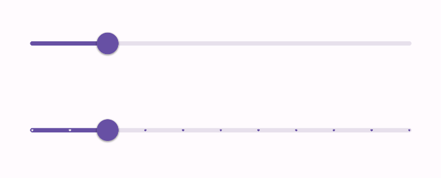
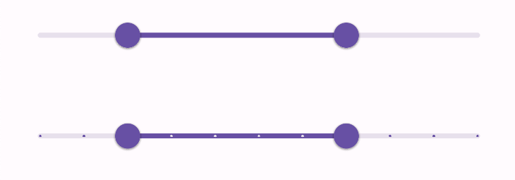

<!--docs:
title: "Sliders"
layout: detail
section: components
excerpt: "Sliders allow users to make selections from a range of values."
iconId: slider
path: /catalog/sliders/
-->

# Slider

[Sliders](https://m3.material.io/components/sliders/) allow users to make
selections from a range of values.


**Contents**

*   [Using sliders](#using-sliders)
*   [Continuous slider](#continuous-slider)
*   [Discrete slider](#discrete-slider)
*   [Theming sliders](#theming-sliders)

## Using sliders

Before you can use Material sliders, you need to add a dependency to the
Material Components for Android library. For more information, go to the
[Getting started](https://github.com/material-components/material-components-android/tree/master/docs/getting-started.md)
page.

### Usage



Add a `Slider` to a layout:

```xml
<!-- Continuous slider -->
<com.google.android.material.slider.Slider
    ...
    android:valueFrom="0.0"
    android:valueTo="100.0"  />

<!-- Discrete slider -->
<com.google.android.material.slider.Slider
    ...
    android:valueFrom="0.0"
    android:valueTo="100.0"
    android:stepSize="10.0"  />
```

Observe changes to a slider:

```kt
slider.addOnSliderTouchListener(object : Slider.OnSliderTouchListener {
    override fun onStartTrackingTouch(slider: Slider) {
        // Responds to when slider's touch event is being started
    }

    override fun onStopTrackingTouch(slider: Slider) {
        // Responds to when slider's touch event is being stopped
    }
})

slider.addOnChangeListener { slider, value, fromUser ->
    // Responds to when slider's value is changed
}
```



Add a `RangeSlider` to a layout:

```xml
<!-- Continuous slider -->
<com.google.android.material.slider.RangeSlider
    ...
    android:valueFrom="0.0"
    android:valueTo="100.0"
    app:values="@array/initial_slider_values"  />

<!-- Discrete slider -->
<com.google.android.material.slider.RangeSlider
    ...
    android:valueFrom="0.0"
    android:valueTo="100.0"
    app:values="@array/initial_slider_values"
    android:stepSize="10.0"  />
```

And in `values/arrays.xml`:

```xml
<resources>
  <array name="initial_slider_values">
    <item>20.0</item>
    <item>70.0</item>
  </array>
</resources>
```

Observe changes to a range slider:

```kt
rangeSlider.addOnSliderTouchListener(object : RangeSlider.OnSliderTouchListener {
    override fun onStartTrackingTouch(slider: RangeSlider) {
        // Responds to when slider's touch event is being started
    }

    override fun onStopTrackingTouch(slider: RangeSlider) {
        // Responds to when slider's touch event is being stopped
    }
})

rangeSlider.addOnChangeListener { rangeSlider, value, fromUser ->
    // Responds to when slider's value is changed
}
```

### Making sliders accessible

Sliders support setting content descriptors for use with screen readers. While
optional, we strongly encourage their use.

That can be done in XML via the `android:contentDescription` attribute or
programmatically:

```kt
slider.contentDescription = contentDescription
```

If using a `TextView` to display the value of the slider, you should set
`android:labelFor` so that screen readers announce that `TextView` refers to the
slider.

The minimum touch target size of the thumb is 48dp by default. If a different
size is needed, please set `minTouchTargetSize` in the style or the layout.

### Adding/removing the value label

By default, the slider will show a value label above the thumb when it's
selected. You can change how it's drawn via the `app:labelBehavior` attribute or
`setLabelBehavior` method.

The modes of `app:labelBehavior` are:

*   `floating` (default) - draws the label floating above the bounds of this
    view
*   `withinBounds` - draws the label floating within the bounds of this view
*   `gone` - prevents the label from being drawn
*   `visible` - always draws the label

### Setting a `LabelFormatter`

By using a `LabelFormatter` you can display the selected value using letters to
indicate magnitude (e.g.: 1.5K, 3M, 12B). That can be achieved through the
`setLabelFormatter` method.

The following example shows a slider for a price range in USD currency.


In code:

```kt
rangeSlider.setLabelFormatter { value: Float ->
    val format = NumberFormat.getCurrencyInstance()
    format.maximumFractionDigits = 0
    format.currency = Currency.getInstance("USD")
    format.format(value.toDouble())
}
```

### Types

There are two types of sliders: 1\. [Continuous slider](#continuous-slider), 2\.
[Discrete slider](#discrete-slider)


A slider with two thumbs is called a range slider.

## Continuous slider

Continuous sliders allow users to make meaningful selections that don’t require
a specific value.

API and source code:

*   `Slider`
    *   [Class definition](https://developer.android.com/reference/com/google/android/material/slider/Slider)
    *   [Class source](https://github.com/material-components/material-components-android/tree/master/lib/java/com/google/android/material/slider/Slider.java)

The following example shows a continuous slider.


In the layout:

```xml
<com.google.android.material.slider.Slider
    android:id="@+id/slider"
    android:layout_width="match_parent"
    android:layout_height="wrap_content"
    android:contentDescription="@string/slider_desc"
    android:value="20.0"
    android:valueFrom="0.0"
    android:valueTo="100.0" />
```

### Continuous range slider

API and source code:

*   `RangeSlider`
    *   [Class definition](https://developer.android.com/reference/com/google/android/material/slider/RangeSlider)
    *   [Class source](https://github.com/material-components/material-components-android/tree/master/lib/java/com/google/android/material/slider/RangeSlider.java)

The following example shows a continuous range slider.


In the layout:

```xml
<com.google.android.material.slider.RangeSlider
  android:id="@+id/range_slider"
  android:layout_width="match_parent"
  android:layout_height="wrap_content"
  android:contentDescription="@string/slider_desc"
  app:values="@array/initial_slider_values"
  android:valueFrom="0.0"
  android:valueTo="100.0" />
```

## Discrete slider

Discrete sliders display a numeric value label upon pressing the thumb, which
allows a user to input an exact value.

API and source code:

*   `Slider`
    *   [Class definition](https://developer.android.com/reference/com/google/android/material/slider/Slider)
    *   [Class source](https://github.com/material-components/material-components-android/tree/master/lib/java/com/google/android/material/slider/Slider.java)

The following example shows a discrete slider.


In the layout:

```xml
<com.google.android.material.slider.Slider
    ...
    android:stepSize="10.0" />
```

### Discrete range slider

API and source code:

*   `RangeSlider`
    *   [Class definition](https://developer.android.com/reference/com/google/android/material/slider/RangeSlider)
    *   [Class source](https://github.com/material-components/material-components-android/tree/master/lib/java/com/google/android/material/slider/RangeSlider.java)

The following example shows a discrete range slider.


In the layout:

```xml
<com.google.android.material.slider.RangeSlider
    ...
    android:stepSize="10.0"  />
```

### Anatomy and key properties

A slider has a track, one or two thumbs, and an optional value label. A discrete
slider also has tick marks.


1.  Track
2.  Thumb
3.  Value label (optional)
4.  Tick mark (discrete sliders)

#### Track attributes

Element                                    | Attribute                | Related method(s)                                         | Default value
------------------------------------------ | ------------------------ | --------------------------------------------------------- | -------------
**Min value**                              | `android:valueFrom`      | `setValueFrom`<br/>`getValueFrom`                         | N/A
**Max value**                              | `android:valueTo`        | `setValueTo`<br/>`getValueTo`                             | N/A
**Step size (discrete)**                   | `android:stepSize`       | `setStepSize`<br/>`getStepSize`                           | N/A
**Initial selected value (Slider)**        | `android:value`          | `setValue`<br/>`getValue`                                 | N/A
**Initial selected values (RangeSlider)**  | `app:values`             | `setValues`<br/>`getValues`                               | N/A
**Height**                                 | `app:trackHeight`        | `setTrackHeight`<br/>`getTrackHeight`                     | `4dp`
**Color**                                  | `app:trackColor`         | `setTrackTintList`<br/>`getTrackTintList`                 | `null`
**Color for track's active part**          | `app:trackColorActive`   | `setTrackActiveTintList`<br/>`getTrackActiveTintList`     | `?attr/colorPrimary`
**Color for track's inactive part**        | `app:trackColorInactive` | `setTrackInactiveTintList`<br/>`getTrackInactiveTintList` | `?attr/colorSurfaceVariant`
**Minimum separation for adjacent thumbs** | `app:minSeparation`      | `setMinSeparation`<br/>`getMinSeparation`                 | `0dp`

**Note:** `app:trackColor` takes precedence over `app:trackColorActive` and
`app:trackColorInative`. It's a shorthand for setting both values to the same
thing.

#### Thumb attributes

Element          | Attribute              | Related method(s)                                                                 | Default value
---------------- | ---------------------- | --------------------------------------------------------------------------------- | -------------
**Color**        | `app:thumbColor`       | `setThumbTintList`<br/>`getThumbTintList`                                         | `?attr/colorPrimary`
**Radius**       | `app:thumbRadius`      | `setThumbRadiusResource`<br/>`setThumbRadius`<br/>`getThumbRadius`                | `10dp`
**Elevation**    | `app:thumbElevation`   | `setThumbElevationResource`<br/>`setThumbElevation`<br/>`getThumbElevation`       | `2dp`
**Halo color**   | `app:haloColor`        | `setHaloTintList`<br/>`getHaloTintList`                                           | `?attr/colorPrimary` at 24%
**Halo radius**  | `app:haloRadius`       | `setHaloRadiusResource`<br/>`setHaloRadius`<br/>`getHaloRadius`                   | `24dp`
**Stroke color** | `app:thumbStrokeColor` | `setThumbStrokeColor`<br/>`setThumbStrokeColorResource`<br/>`getThumbStrokeColor` | `null`
**Stroke width** | `app:thumbStrokeWidth` | `setThumbStrokeWidth`<br/>`setThumbStrokeWidthResource`<br/>`getThumbStrokeWidth` | `0dp`

#### Value label attributes

Element       | Attribute           | Related method(s)                           | Default value
------------- | ------------------- | ------------------------------------------- | -------------
**Style**     | `app:labelStyle`    | N/A                                         | `@style/Widget.Material3.Tooltip`
**Formatter** | N/A                 | `setLabelFormatter`<br/>`hasLabelFormatter` | `null`
**Behavior**  | `app:labelBehavior` | `setLabelBehavior`<br/>`getLabelBehavior`   | `floating`

**Note:** The value label is a
[Tooltip](https://github.com/material-components/material-components-android/tree/master/lib/java/com/google/android/material/tooltip/TooltipDrawable.java).

#### Tick mark attributes

Element                             | Attribute                | Related method(s)                                       | Default value
----------------------------------- | ------------------------ | ------------------------------------------------------- | -------------
**Color**                           | `app:tickColor`          | `setTickTintList`<br/>`getTickTintList`                 | `null`
**Color for tick's active part**    | `app:tickColorActive`    | `setTickActiveTintList`<br/>`getTickActiveTintList`     | `?attr/colorSurfaceVariant`
**Color for tick's inactive part**  | `app:tickColorInactive`  | `setTickInactiveTintList`<br/>`getTickInactiveTintList` | `?attr/colorPrimary`
**Radius for tick's active part**   | `app:tickRadiusActive`   | `setTickActiveRadius`<br/>`getTickActiveRadius`         | `1dp`
**Radius for tick's inactive part** | `app:tickRadiusInactive` | `setTickInactiveRadius`<br/>`getTickInactiveRadius`     | `1dp`
**Tick visible**                    | `app:tickVisible`        | `setTickVisible`<br/>`isTickVisible()`                  | `true`

**Note:** `app:tickColor` takes precedence over `app:tickColorActive` and
`app:tickColorInative`. It's a shorthand for setting both values to the same
thing.

#### Styles

Element           | Style
----------------- | -------------------------
**Default style** | `Widget.Material3.Slider`

Default style theme attribute: `?attr/sliderStyle`

See the full list of
[styles](https://github.com/material-components/material-components-android/tree/master/lib/java/com/google/android/material/slider/res/values/styles.xml)
and
[attributes](https://github.com/material-components/material-components-android/tree/master/lib/java/com/google/android/material/slider/res/values/attrs.xml).

## Theming sliders

Sliders support
[Material Theming](https://material.io/components/sliders#theming) which can
customize color and typography.

### Slider theming example

API and source code:

*   `Slider`
    *   [Class definition](https://developer.android.com/reference/com/google/android/material/slider/Slider)
    *   [Class source](https://github.com/material-components/material-components-android/tree/master/lib/java/com/google/android/material/slider/Slider.java)
*   `RangeSlider`
    *   [Class definition](https://developer.android.com/reference/com/google/android/material/slider/RangeSlider)
    *   [Class source](https://github.com/material-components/material-components-android/tree/master/lib/java/com/google/android/material/slider/RangeSlider.java)

The following example shows a range slider with Material Theming.


#### Implementing slider theming

Use theme attributes and styles in `res/values/styles.xml` which applies to all
sliders and affects other components:

```xml
<style name="Theme.App" parent="Theme.Material3.*">
    ...
    <item name="colorPrimary">@color/shrine_pink_100</item>
    <item name="colorOnPrimary">@color/shrine_pink_900</item>
    <item name="colorOnSurface">@color/shrine_pink_100</item>
</style>
```

Use a default style theme attribute, styles and a theme overlay which applies to
all sliders but does not affect other components:

```xml
<style name="Theme.App" parent="Theme.Material3.*">
    ...
    <item name="sliderStyle">@style/Widget.App.Slider</item>
</style>

<style name="Widget.App.Slider" parent="Widget.Material3.Slider">
    <item name="materialThemeOverlay">@style/ThemeOverlay.App.Slider</item>
    <item name="labelStyle">@style/Widget.App.Tooltip</item>
  </style>

<style name="ThemeOverlay.App.Slider" parent="">
    <item name="colorPrimary">@color/shrine_pink_100</item>
    <item name="colorOnPrimary">@color/shrine_pink_900</item>
    <item name="colorOnSurface">@color/shrine_pink_100</item>
</style>

<style name="Widget.App.Tooltip" parent="Widget.Material3.Tooltip">
    <item name="android:textAppearance">@style/TextAppearance.App.Tooltip</item>
    <item name="backgroundTint">@color/shrine_pink_900</item>
  </style>

<style name="TextAppearance.App.Tooltip" parent="TextAppearance.Material3.BodySmall">
  <item name="android:textColor">@color/shrine_pink_100</item>
  <item name="fontFamily">@font/rubik</item>
  <item name="android:fontFamily">@font/rubik</item>
</style>
```

Use the style in the layout, which affects only this specific slider:

```xml
<com.google.android.material.slider.RangeSlider
    ...
    style="@style/Widget.App.Slider"  />
```
